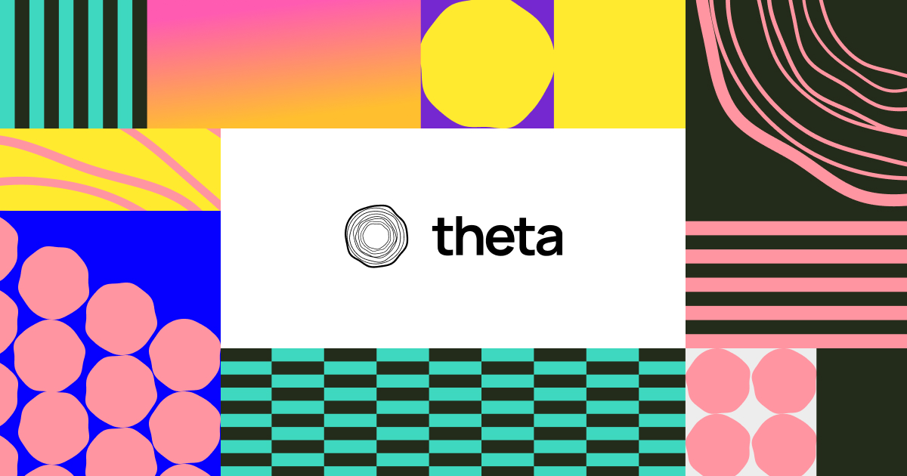

# Build with Theta

[Theta](https://buildwiththeta.com) is an open source tool to streamline app creation and testing with dynamic UIs, without the need for rebuilding.

- [ ] Theta Studio: no-code visual editor for reponsive and modern UIs. [Docs]()
- [ ] Theta Builder: Stream your UIs inside your clients. [Docs]()
  - [x] Flutter support. [Docs](). [Pub.dev]().

## Documentation
Learn about Theta on [docs.buildwiththeta.com]()

## Support
- [GitHub Discussions](https://github.com/buildwiththeta/buildwiththeta/discussions): Ideal for general questions, Q&A, product use assistance, best practice discussions.
- [GitHub Issues](https://github.com/buildwiththeta/buildwiththeta/issues): Ideal for reporting bugs and problems while using Theta
- Email Support: Ideal for reporting problems with your personal projects.
- [Discord](https://discord.gg/BdhDRZb7tu): Ideal for sharing projects and portfolios with the community.

## Status
- [x] Alpha: Experimental.
- [x] Closed Beta: Still under development. Except bugs and errors.
- [ ] Beta: Still pretty stable, no expected break changes in future.
- [ ] Stable: Production-ready.

Check [Releases](https://github.com/buildwiththeta/buildwiththeta/releases) to see our current status and all updates.

